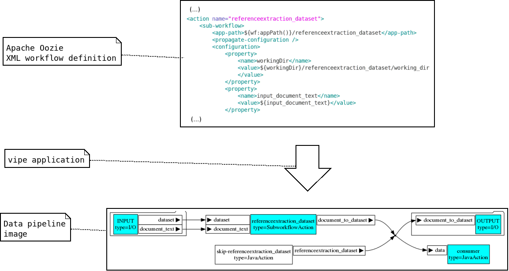
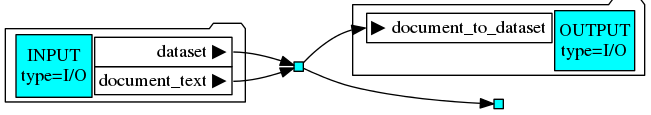
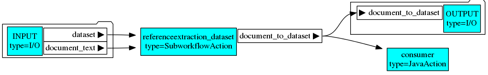
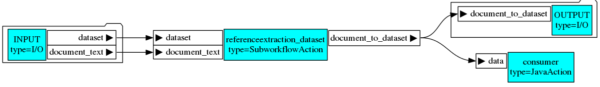
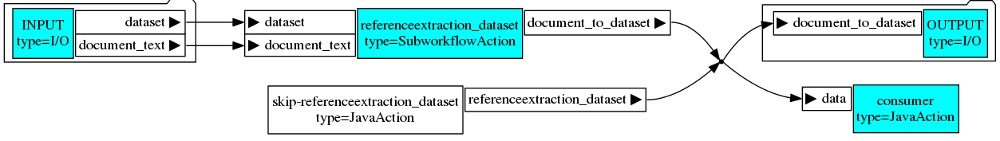
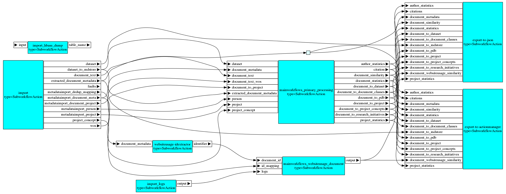
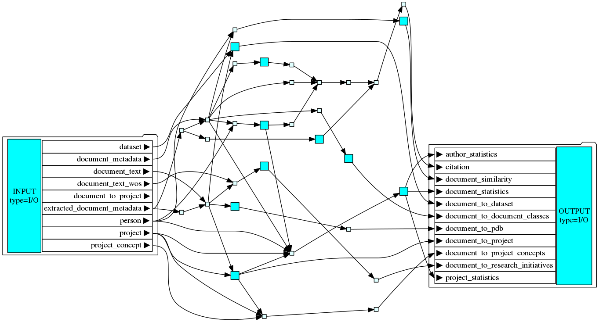
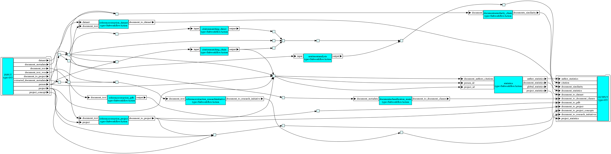
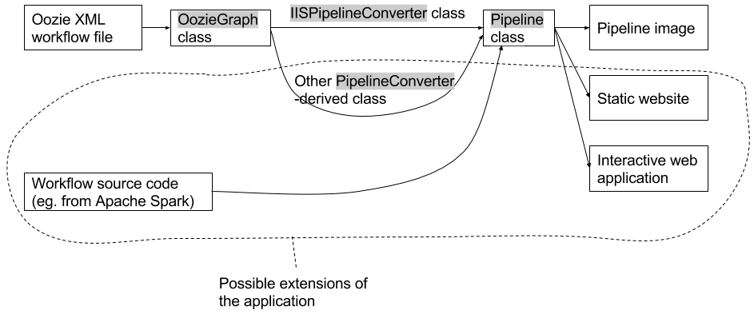

# About

This is a tool for visualizing Apache Oozie workflows as data flow pipelines. 

_Fig. 1_: Visual summary of what the tool does.

The tool is a command-line application that ingests imperative description of a workflow in Apache Oozie XML file and converts it to a data pipeline representation in PNG image file. Note that in order for the application to be able to extract the pipeline representation, content of the Oozie XML file has to follow certain conventions (e.g., the names of Oozie action properties that correspond to ports have to follow a convention of being prefixed with "input" or "output" string). See file `vipe/oozie/converter/iis.py` for a code which follows such conventions used in workflow definitions of [OpenAIRE IIS project][IIS].

[IIS]: https://github.com/openaire/iis

# How to install and run

Run `pip install vipe` to install the stable version of the software from PyPI repository. After installing the software, you can run it by executing `vipe-oozie2png` (run `vipe-oozie2png --help` for usage instructions).

Note that the following libraries have to be installed in the system for the tool to work:

- `libyaml` (this is required by `pyyaml` library used by the solution) - on Ubuntu 14.04 system, this can be installed by running `apt-get install libyaml-dev`
- [GraphViz](graphiz.org) - on Ubuntu 14.04 system, this can installed by running `apt-get install graphviz`.

# Goals

There are two main goals of the solution: 

- Show existing **workflows without distracting technical details** (i.e. a high-level/business view). In order to achieve it, the application shows only data dependencies between workflow nodes, i.e. if one node is a producer of data consumed by other workflow node, a link between them is shown. If two nodes are executed one after another but their order is not really important (in such case the order is defined just out of convenience or because both of them need to have access to full computational resources), the information about their order is not visible. The user of the application can also specify a detail level of the visualization.
- Make **data passed between workflow nodes a first-class citizen**. The user of the visualization should focus on the most important aspect of the defined workflows - flow of the data between the modules.

# Example visualizations

This section contains example visualization of various workflows. The visualization were generated with the application version 0.5.

## Simple workflow

Below we show visualization of Oozie workflow [`vipe/oozie/test/data/bypass/workflow.xml`](vipe/oozie/test/data/bypass/workflow.xml). Internally, this workflow is converted to `OozieGraph` representation (see its YAML representation in [`vipe/oozie/test/data/bypass/workflow.yaml`](vipe/oozie/test/data/bypass/workflow.yaml)) and then subsequently to `Pipeline` representation (see its YAML representation in [`vipe/oozie/test/data/bypass/pipeline.yaml`](vipe/oozie/test/data/bypass/pipeline.yaml)) and then finally to a PNG image.

See Fig. 2-5 for visualizations of the workflow with different levels of details as specified by the user.

_Fig. 2_: Simple workflow visualized with the lowest level of details.

_Fig. 3_: Simple workflow visualized with medium level of details.

_Fig. 4_: Simple workflow visualized with medium level of details with input and output ports shown.

_Fig. 5_: Simple workflow visualized with the highest level of detail with input and output ports shown.

## Workflows from OpenAIRE IIS project

In this section, we show visualizations generated for real-life workflows from [OpenAIRE IIS project][IIS] - see Fig. 6-8.

_Fig. 6_: Primary-main workflow from OpenAIRE IIS project with medium level of detail.

_Fig. 7_: Primary-processing workflow from OpenAIRE IIS project with the lowest level of detail.

_Fig. 8_: Primary-processing workflow from OpenAIRE IIS project with medium level of detail.

# Features

## User-visible features

Features visible to the user of the application are listed below. Note that we use a notion of port (see chapter 3 of Gregor Hohpe, Bobby Woolf: "Enterprise Integration Patterns: Designing, Building, and Deploying Messaging Solutions", Addison-Wesley, 2003) corresponding to a join point between node and connection in a data pipeline graph.

- The produced pipeline representation can be either **PNG image or YAML-formatted text file**.
- Each workflow node can have its **input and output ports shown**; ports are connected using arrows to show the producer-consumer dependencies. 
- There are **many detail levels** on which the graph can be shown. The amount of detail shown on each detail level depends on priority assigned to different kind of nodes and on options given to the application. The priority is implemented in a well-separated part of the code responsible for interpreting custom conventions used in Oozie XML file (file `vipe/oozie/converter/iis.py` in the source code contains such code for conventions used in workflow definitions of [OpenAIRE IIS project][IIS]) and thus it is reasonably easy for a developer to adjust it to Oozie XML conventions used in a different project.
- The produced graph can have either **horizontal or vertical orientation**.

## Developer-visible features

In this section, we describe internal features of the solution that are of interest of people who want to extend its code.

**Extensibility areas**. The application was designed and implemented with extensibility in mind - we wanted to make it **easily extensible in the following areas**.

- **Input descriptions of workflow**, e.g. possibility to analyze source code instead of Oozie XML file.
- **Conventions used in the Oozie XML** file, i.e. possibility to use different conventions of describing workflows, other than the ones used in [OpenAIRE IIS project][IIS]. Namely, the developer should be required only to implement a new `PipelineConverter`-derived class.
- **Output artefacts**, e.g. producing website or interactive web applications instead of static images.

**Processing stages**. In order to attain mentioned extensibility goals, the processing in the application was separated into stages shown in Fig. 9.

_Fig. 9_: Data processing in the application. Boxes correspond to data structures or files while the arrows correspond to processing steps. The area enclosed with dotted line shows discussed potential future extensions of the application. Names highlighted in gray correspond to names of classes in the source code.

**Intermediate representations**. It is worth noting that there are two intermediate representations of the workflow (as shown in Fig. 9):

- `OozieGraph` class that corresponds directly to objects defined in Oozie XML workflow file,
- `Pipeline` class corresponding to data pipeline representation of the processing. It contains information about dependencies between workflow nodes and data passed between them. It doesn’t store information about the order in which the workflow nodes are defined.

A `PipelineConverter`-derived class is used to translate `OozieGraph` into `Pipeline`.

# Code development

Python packages that the application depends on are listed in the `requirements.txt` file. Note that the project is written in Python 3, so you need to install Python 3 version of these dependencies (on Ubuntu 14.04 system you can do it by executing, e.g. `sudo pip3 install pytest`).

The **docstrings** in the code follow [Google style guide](https://google-styleguide.googlecode.com/svn/trunk/pyguide.html#Comments) with types declared in accordance to [Sphinx](http://sphinx-doc.org/)'s [type annotating conventions](http://sphinx-doc.org/latest/ext/example_google.html). Note that you have to use Sphinx version at least 1.3 if you want to generate documentation with type annotations.

# Future work

Possible future extensions of the application are listed below.

- Generate an interlinked website containing visualization of all workflows and subworkflows along with some additional information, like a list of all input and output ports with the type of data they ingest or produce.
- Show types of data related to each port.
- Show links from the names of types of data related to each port to their schemas (extracted from surrounding system’s source code). 
- Show link to the Oozie XML workflow corresponding to given diagram (it should be extracted from surrounding system’s source code).
- Show comments and descriptions from the original Oozie workflow definition.
- Show some statistics related to the workflow (e.g., number of nodes).
- Check whether data passed between workflow nodes is compatible (i.e. check that there is no such situation that a data produced by a certain workflow node is incompatible with data consumed by its consumer). This would be akin to static type checking for the workflow.

# License

The code is licensed under Apache License, Version 2.0
